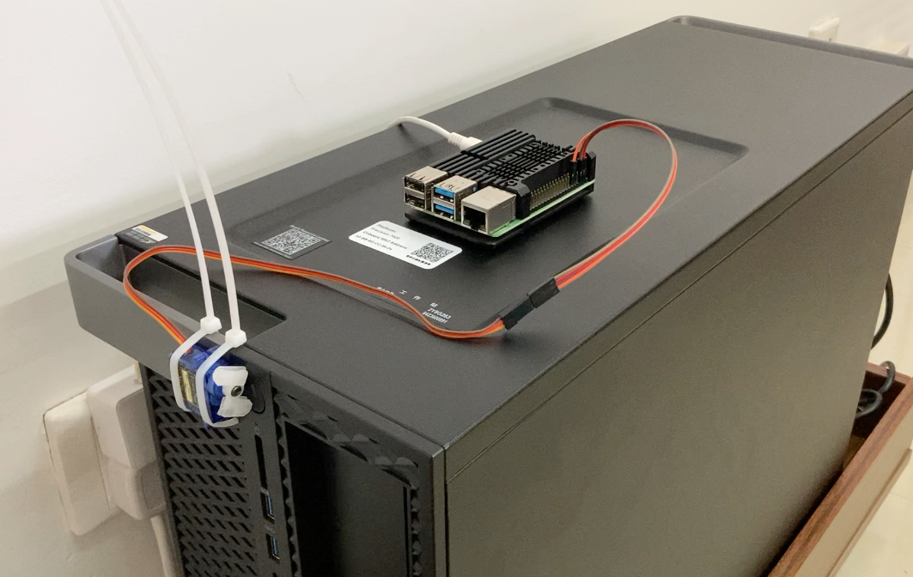
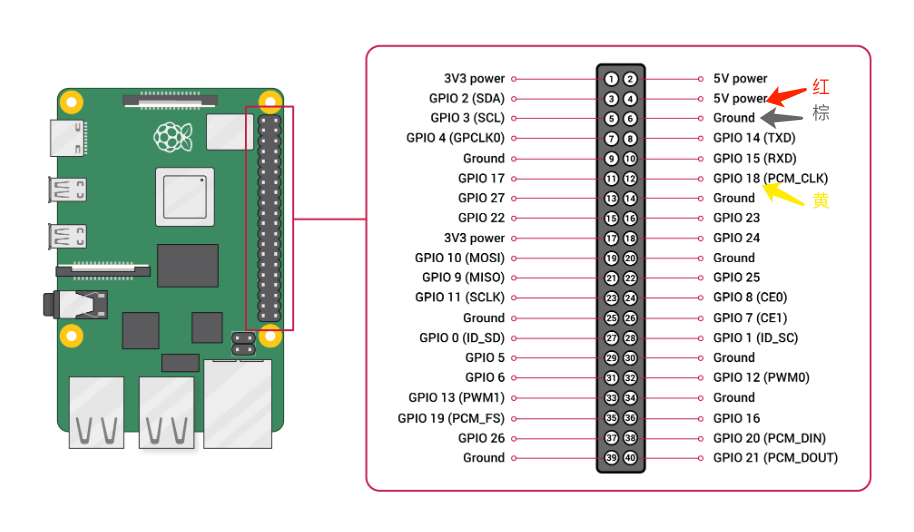

# 内网穿透 + 远程遥控开机

## 讲解及演示见B站

[B站链接](https://www.bilibili.com/video/BV18v4y1o7QY)

## 成品图

由于网络原因，图片可能加载不出来，下载本项目，连线图和成品图都在里面

## 树莓派到舵机的连线方式

## 树莓派控制舵机代码

见 remoteSwitch

## FRP启动代码

见 frp

注意要手动创建log文件夹
